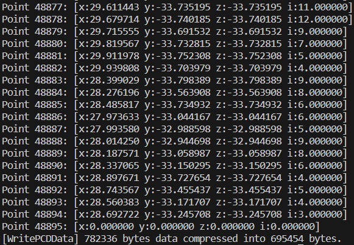

# PointcloudIO

#### 介绍

简单的PCD文件读写库，只依赖Eigen，不依赖open3d或者pcl二个庞大的库，目前支持V0.6和V0.7，其它版本尚未测试但应该也支持。支持xyz、intensity、normal、color字段读写。

#### 软件架构

跨平台支持 windows、ubuntu

#### 安装教程

1. 修改CMakeLists.txt文件内eigen3引用目录
2. 在工程目录下执行如下命令

```bash

# 编译 
mkdir build
cd build
cmake ..
make

# 执行
./PointCloudIO
```
  
  

#### 使用

1. 引用`PointCloudIO.h`头文件
2. 生成`PointCloud`点云对象
3. 调用`pcd::io::ReadPointCloudFromPCD`接口读取
4. 写PCD文件调用`pcd::io::WritePointCloudToPCD`,需要配置写入明码还是二进制，二进制是否需要压缩,通过`pcd::io::WritePointCloudOption`选项控制

```C++
#include "PointCloudIO.h"

int main(int argc, char **argv)
{
    //读取PCD
    auto cloud_ptr = std::make_shared<pcd::geometry::PointCloud>();
    pcd::io::ReadPointCloudFromPCD("/mnt/d/010734.pcd", *cloud_ptr);
    fprintf(stderr, "Point count: %ld\n", cloud_ptr->points_.size());
    for (size_t i = 0; i < cloud_ptr->points_.size(); i++)
    {
        /* code */
        cloud_ptr->intensitys_.at(i) *= 255;
        Eigen::Vector3d &xyz_ = cloud_ptr->points_.at(i);
        fprintf(stderr, "Point %ld: [x:%f y:%f z:%f i:%f]\n", i, xyz_[0], xyz_[1], xyz_[1], cloud_ptr->intensitys_.at(i));
    }

    //写PCD
    pcd::io::WritePointCloudOption option_(false, true);
    pcd::io::WritePointCloudToPCD("/mnt/d/010734-1.pcd", *cloud_ptr, option_);

    return 0;
}
```
